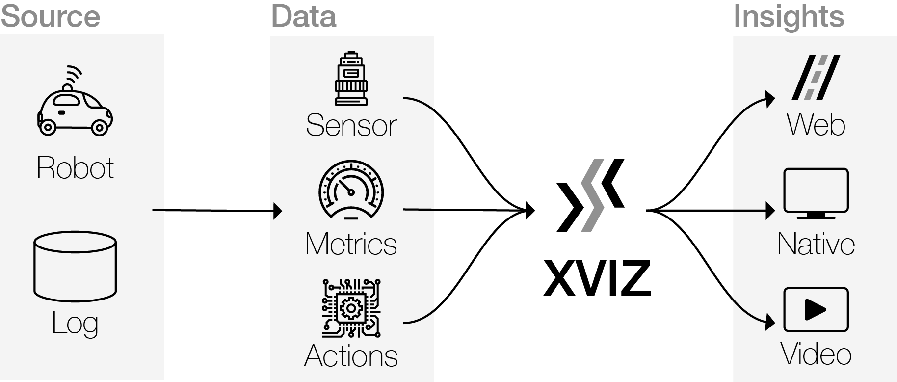

# XVIZ

[](https://coveralls.io/github/uber/xviz?branch=master)

XVIZ is a protocol for real-time transfer and visualization of autonomy data. Learn more in the
[docs and specification](http://avs.auto/#/xviz).



## Tools and examples

This repo contains the following submodules:

- `@xviz/builder` - Node.js utilities for converting data to the XVIZ protocol.
- `@xviz/cli` - CLI utilities for the XVIZ protocol.
- `@xviz/io` - Library for loading, accessing, and manipulating XVIZ data.
- `@xviz/parser` - Client-side decoder and synchronizer for consuming XVIZ data.
- `@xviz/schema` - Validation and schemas for the XVIZ protocol.
- `@xviz/server` - A complete server module supporting the full XVIZ protocol.

And examples:

- Sample converters that convert open datasets such as
  [KITTI](http://www.cvlibs.net/datasets/kitti/raw_data.php) and [Nutonomy](https://nuscenes.org) to
  the XVIZ protocol.

## Quick start

You need [Node.js](https://nodejs.org/en/) and [yarn](https://yarnpkg.com/lang/en/docs/install) to
run the examples.

```bash
# Clone XVIZ
$ git clone https://github.com/uber/xviz.git
$ cd xviz

# Install dependencies
$ yarn bootstrap
```

Convert and serve KITTI example data:

```bash
# Download KITTI data
$ ./scripts/download-kitti-data.sh

# Convert KITTI data if necessary and run the XVIZ Server and Client
$ ./scripts/run-kitti-example.sh
```

## NPM Scripts

- `bootstrap` - install dependencies
- `build` - rebuild all modules
- `test` - run full tests (lint, unit tests in node and headless browser)
- `test bench` | `bench` - run benchmark tests
- `test bench-browser` - run benchmark tests in browser
- `test node` - run unit tests in Node
- `test browser` - run tests in browser
- `test browser-headless` - run tests in headless browser
- `lint` - run lint
- `lint fix` - run prettier
- `publish beta` - publish beta release
- `publish prod` - publish production release

## Requirements for Contribution

The pre-commit hook `yarn test-fast` requires you to have `jq` installed:

```
brew install jq
```
