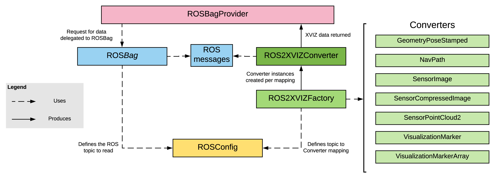
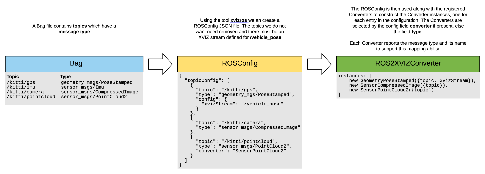

# @xviz/ros

The **@xviz/ros** provides support for reading ROS Bags and convertring ROS Messages into XVIZ data.

This module will support the following:

- Reading ROS Bag files
- A configuration based conversion workflow
- Custom message conversion
- Off-line conversion
- Run-time conversion

The focus is on ROS 1, but most if not all of this translates to ROS 2 as well.

### Examples

See our code examples:

- [Basic ROS Bag](https://github.com/uber/xviz/tree/master/examples/converters/ros)
- [Custom ROS Bag Message Types](https://github.com/uber/xviz/tree/master/examples/converters/ros-custom)

### Access to ROS data

At the lowest level we need to read ROS Bag files and covert the messages to XVIZ. This is achieved
with the [ROSBag](/docs/api-reference/ros/ros-bag.md) class to read ROS bags, and a set of
[Converters](/docs/api-reference/ros/overview-converters.md) to managed turning ROS message into
XVIZ.

### Convertering ROS messages to XVIZ

In order to provide control for how this mapping happens and conversion support for ROS messages we
may not support, we provide the classes [ROSConfig](/docs/api-reference/ros/ros-config.md) and
[ROS2XVIZConverter](/docs/api-reference/ros/ros-2-xviz-converter.md).

The **ROSConfig** allows the selection of specific topics along with the ability to have some
control over how that mapping happens. Placing the topic to converter mapping, along with converter
options, in a single configuration will hopefully make utilizing ROS data easier.

The **ROS2XVIZConverter** serves as a repository for registered Converters and will dispatch
messages to the conversion along with any options set in the configuration. This allows for custom
conversion classes to be registered and used.

### Integrating with the XVIZ eco-system

In order to allow ROS data to work across our other tools, we encapsulate the details in the
[ROSBagProvider](/docs/api-reference/ros/ros-bag-provider.md). This provider allows our tooling that
operates on the Providers abstraction to work with ROS data seamlessly.

This requires the use of the [ROS2XVIZFactory](/docs/api-reference/ros/ros-2-xviz-factory.md) which
enables the instantiation of a **ROS2XVIZConverter** at a later time.

# Module Classes and Objects

## Converters

[Converters](/docs/api-reference/ros/overview-converters.md) are the classes that read the ROS topic
message and convert to XVIZ.

## ROS2XVIZConverter

[ROS2XVIZConverter](/docs/api-reference/ros/ros-2-xviz-converter.md) is the class manages calling
the proper converter for a specific message. It must know the available Converters as the
[ROSConfig](/docs/api-reference/ros/ros-config.md)

## ROSConfig

The [ROSConfig](/docs/api-reference/ros/ros-config.md) defines a schema used to describe the mapping
from ROS Topics to a Converter. Normally messages are mapped by the ROS message type but custom
converters can be chosen to override the default.

In addition options for the converter can be specified in the configuration.

## ROSBag

The [ROSBag](/docs/api-reference/ros/ros-bag.md) class provides access to the ROS messages and data.

This class can be subclassed to provide validation and additonal context for your custom conversion
requirements.

This class is used by the [ROSBagProvider](/docs/api-reference/ros/ros-bag-provider.md) to read
messages and have them convertered into XVIZ.

## ROS2XVIZFactory

The [ROS2XVIZFactory](/docs/api-reference/ros/ros-2-xviz-factory.md) holds on to a set of
[Converters](/docs/api-reference/ros/overview-converters.md) that will be used to construct a
[ROS2XVIZConverter](/docs/api-reference/ros/ros-2-xviz-converter.md).

## ROSBagProvider

The [ROSBagProvider](/docs/api-reference/ros/ros-bag-provider.md) provides a high-level interface to
accessing XVIZ data from a ROSBag. It requires the classes described above to manage access to the
ROS bag data, mapping of topics to converters, and the actual conversion process.
