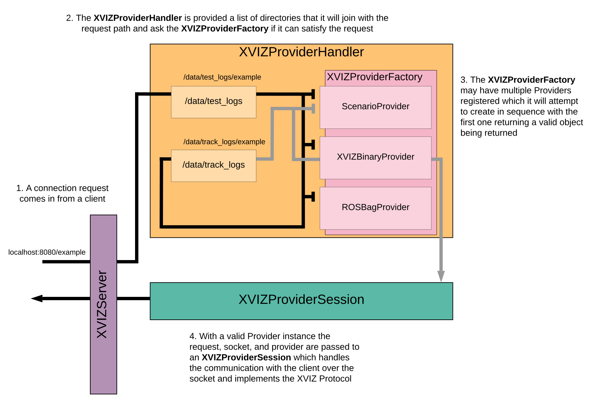

# XVIZHandler Interface

An XVIZHandler will be called to provide an
[XVIZSession](/docs/api-reference/server/overview-session.md) to handle the request made to the
[XVIZServer](/docs/api-reference/server/xviz-server.md).

### Interface

##### async newSession(socket, request)

Using the `socket` and `request` a handler must decide if this connection can be handled.

Parameters:

- `socket` (Object) - The socket from the server
- `request` (Object) - The request object from the server

Returns: ([XVIZSession](/docs/api-reference/server/overview-session.md)|null) - A session to handle
this connection or null if the request cannot be handled.

### XVIZProviderHandler Example

The [xvizserver tool](/docs/api-reference/server/tools/xvizserver-tool.md) uses this modules
[XVIZProviderHandler](https://github.com/uber/xviz/blob/master/modules/server/src/server/xviz-provider-handler.js)
implementation to host XVIZ data.

Below we can see the flow where the XVIZProviderHandler uses an array of directories and then calls
the [XVIZProviderFactory](/docs/api-reference/io/xviz-provider-factory.md) to attempt to satisfy the
request and returns the XVIZProviderSession upon a successful find.

_Diagram of the flow for how the XVIZProviderHandler creates an XVIZProviderSession_
