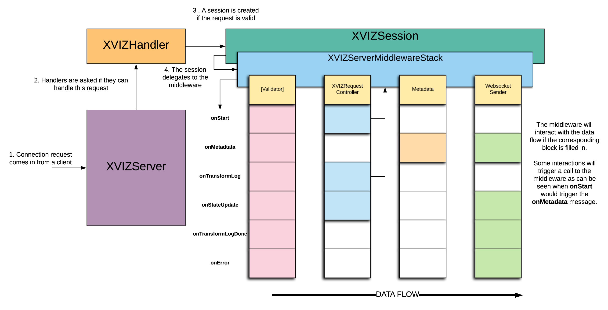

# @xviz/server

The **@xviz/server** module provides a framework for serving XVIZ data over a Websocket.

The [XVIZServer](/docs/api-reference/server/xviz-server.md) will delegate a request to the array of
[XVIZHandlers](/docs/api-reference/server/overview-handler.md) that have been passed into when it is
constructed. The XVIZHandlers will attempt to handle the request and if it can will return an
instance of an [XVIZSession](/docs/api-reference/server/overview-session.md). The rest of the client
communication is then handled by the XVIZSession, specifically the
[XVIZ Protocol](/docs/protocol-schema/session-protocol.md).

_Diagram of the @xviz/server class relationships and data flow_

## Usage

To use the XVIZServer we provide a command-line tool
[xvizserver](/docs/api-reference/server/tools/xvizserver-tool.md). This tool provides the ability to
host XVIZ data from multiple directories at once.

## Extending the XVIZServer

The design of the XVIZServer and XVIZHandler allow anyone to connect customized Handlers for their
use-case in a simple manner following the existing implementation of the handler as a guide.

# Module Classes

## XVIZServer

The [XVIZServer](/docs/api-reference/server/xviz-server.md) is the main class that will start
listening for connection and delegate to the
[XVIZHandlers](/docs/api-reference/server/overview-handler.md) registered.

## XVIZHandler Interface

An [XVIZHandler](/docs/api-reference/server/overview-handler.md) serves the single role to determine
if a connection can be handled and if so return an
[XVIZSession](/docs/api-reference/server/overview-session.md) to manage that request.

## XVIZSession Interface

[XVIZSession](/docs/api-reference/server/overview-session.md) has the role to respond to websocket
events and route the messages through the
[XVIZServerMiddlewareStack](/docs/api-reference/server/xviz-server-middleware-stack.md)

## XVIZServerMiddlewareStack

The [XVIZServerMiddlewareStack](/docs/api-reference/server/xviz-server-middleware-stack.md) provides
the structure for the middleware components and manages the routing of messages through the
registered components.

## Middleware components

The middleware components are objects that will only define methods for the XVIZ messages they need
to act upon. The [interface](/docs/api-reference/server/overview-middleware.md) for these methods is
derived from the
[XVIZServerMiddlewareStack](/docs/api-reference/server/xviz-server-middleware-stack.md).

These components could operate on the messages and response, store session state in a shared
context, and make calls to the middleware stack in response to an event.
