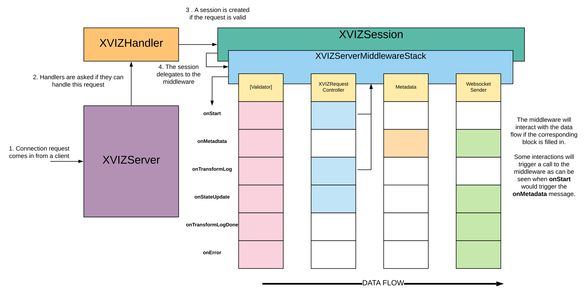

# XVIZServer

The XVIZServer will listen on a port for connections. Upon a connection the server will attempt to
find a handler that can satisfy the request. If a handler is found it will be called to manage the
request else the socket will be closed.



_Diagram of the @xviz/server class relationships and data flow_

## Example

```js
import {XVIZServer} from '@xviz/server';

// Construction of 'handler'

const ws = new XVIZServer([handler], options, () => {
  console.log(`Listening on port ${ws.server.address().port}`);
});
```

## Constructor

## XVIZServer(handlers, options, cb)

The `options` argument is passed through to the underlying Websocket server.

Parameters:

- `handlers` (Array) - Set of [XVIZHandler](/docs/api-reference/server/overview-handler.md)
  instances to service requests
- `options` (Object) - Options for the Server

  - `port` (Number) - Port to listen on
  - `maxPayload` (Number) - Maximum allowed message size in bytes
  - `perMessageDeflate` (Boolean) - Setting if message compress on the websocket is enabled
  - `logger` (Object) - Logger object passed through the system

    - `log` (Function) - Function that will always display the message
    - `error` (Function) - Function for error level messages
    - `warn` (Function) - Function for warning level messages
    - `info` (Function) - Function for info level messages
    - `verbose` (Function) - Function for verbose level messages

- `cb` (Function) - Callback called when the server is listening.

## Properties

##### server

Access to the underlying server object.

Returns: (Object) - The underlying WebSocket server object

## Methods

##### close()

Terminate the server.
