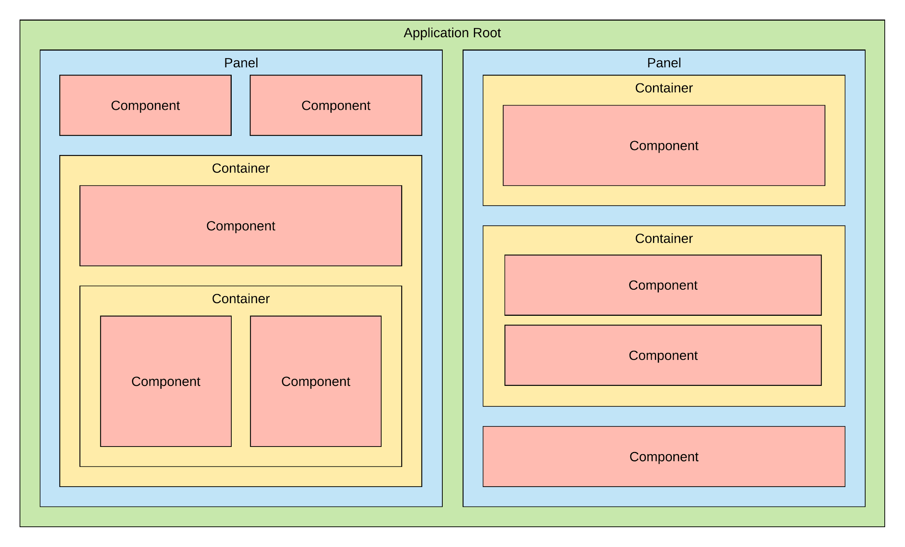

# Declarative UI

## Overview

The purpose of the XVIZ Declarative UI is to enable developers to create interactive visuals using
configuration from a backend. The declarative UI system is designed to provide a simple and
extensible UI description system so that application developers can control what data is created and
independent of understanding the intricacies of a specific XVIZ client application.

## Data Model

Declarative UI data is a hierarchical structure of layout elements and components. Components make
up the majority of visuals with layout elements primarily providing information about how to
organize their contents and supplemental information about the contents.

_UML diagram of the UI data model_

_Example skeleton UI showing how the pieces fit together_
