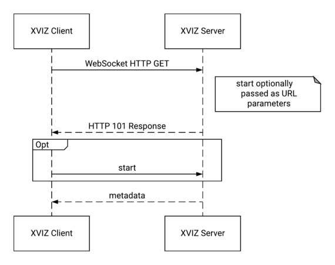
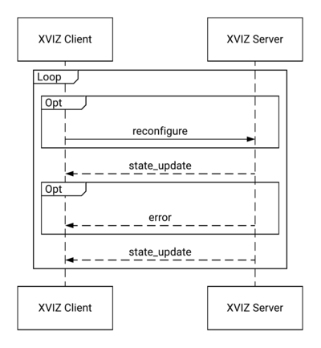
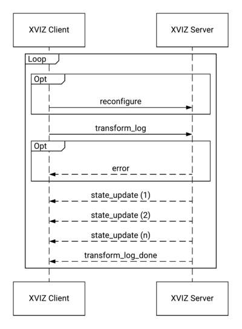

# Session Protocol Specification

XVIZ can be used to visualize data from a running system or logged data. In this contexts a client
connects to a server and establishes a session. At the start of the session the available streams
and parameters are setup.

## Server Types

XVIZ servers can exist in a variety of types that effect what transforms they can do on data, and
whether than be reconfigured. Typical types are:

- **dynamic-log** - these transform raw underlying data into XVIZ on demand, these can respond to
  all command types.
- **static-log** - serving static XVIZ data from a storage location, these cannot respond to any
  reconfigure commands
- **live** - embedded in a running system, these typically cannot respond to any transform commands,
  but can be reconfigured.

## Session Message Flow

An XVIZ client and server establish a session that is focused on data from a single log or live
scene. A session is first initiated by a client with some parameters, to which the server responds
with metadata. Then either streaming or on demand data transfer beings. Optionally clients can use
the unstable reconfiguration feature to change how the server is transforming data for the client.

The session protocol is currently defined, and designed, to operator over a WebSocket, or similar
reliable, in order, datagram based communications channel.

### Initialization

Each session is started by a client connecting to the server, in the WebSocket case this involves an
HTTP GET request that is upgraded by the server to a persistent WebSocket connection. Termination of
the connection terminates the session.

After connection is established client starts by sending the [`START`](#START) message, which sets
the type of session and various other parameters. In the WebSocket case you can send the
[`START`](#START) properties as URL parameters eliminating the need to send the message. The server
responds with a [`METADATA`](#METADATA) message that contains various information about the XVIZ
data the server can provide.



_UML Sequence diagram of an XVIZ session initialization_

### Data Transfer - Live

Upon start of a live session the server will immediately, and continuously send the client
[`STATE_UPDATE`](#STATE_UPDATE) messages at an undefined rate.

Optionally the unstable [`RECONFIGURE`](#reconfigure-warning-unstable-feature-) message can be sent
to the server to change future data send to the server.



_UML Sequence diagram of transforming a live session with XVIZ_

### Data Transfer - Logs

To request log data the client starts with a [`transform_log`](#transform_log) request that
specifies the time range of the log to send back along with a request id. The server then responds
with an indeterminate number of [`STATE_UPDATE`](#STATE_UPDATE) messages. When complete it sends the
`done` message tagged with given request id.

Optionally the unstable [`RECONFIGURE`](#reconfigure-warning-unstable-feature-) message can be sent
to the server to change way data is transformed for future requests.



_UML Sequence diagram of viewing a log with XVIZ_

### Data Transfer - Point In Time

To get a single picture of the world at a specific time the client sends a
[`TRANSFORM_POINT_IN_TIME`](#transform_point_in_time-warning-unstable-feature-) message, and the
server responds with a single [`STATE_UPDATE`](#STATE_UPDATE) containing a full world snapshot.

### Reconfiguration

Optionally the unstable [`RECONFIGURE`](#reconfigure-warning-unstable-feature-) message can be sent
to the server to change way data is transformed for future requests. This can happen any time after
the connection has been initialized.

## Session Message Types

These describe client server communication to start and manage sessions.

### START

Sent by the client to the service or encoded as URL parameters. When the server gets this message it
will start streaming data to the client as soon as it can.

Common Parameters:

| Name             | Type               | Description                                                                                   |
| ---------------- | ------------------ | --------------------------------------------------------------------------------------------- |
| `version`        | `string`           | Protocol version, for example `2.0.0`                                                         |
| `profile`        | `optional<string>` | The backend configuration, defines the content, type, and selections of streams you will get. |
| `session_type`   | `optional<string>` | Type of session being opened up, default is `LOG`                                             |
| `message_format` | `optional<string>` | Format the data will be represented in, default value is `JSON`.                              |
| `log`            | `optional<string>` | When the `session_type` = `LOG`, this parameters identifies which log to open.                |

**errors** The follow fields do not accept all parameters,

- `profile` - if the value is not supported an [`error`](#error) message will be sent. If the server
  is a [static-log](#server-types) type it will continue to send data, otherwise the connection
  closed.
- `session_type` - if the type is not supported an [`error`](#error) message will be sent and the
  connection closed.
- `message_format` - if the type is not supported an [`error`](#error) message will be sent and the
  connection closed.

**session_type** - valid values:

- `LIVE` - send data in real time
- `LOG` - show data from a log

**message_format** - valid values:

- `JSON` - JSON types encoded as UT8 strings.
- `BINARY` - Our GLB based binary container format.

### METADATA

Sent by server to the client upon connection. Contains information about the XVIZ streams to expect
in messages, the cameras, and the Declarative UI panels.

| Name             | Type                              | Description                                                                                                                                                                                                                                        |
| ---------------- | --------------------------------- | -------------------------------------------------------------------------------------------------------------------------------------------------------------------------------------------------------------------------------------------------- |
| `version`        | `string`                          | Protocol version, for example `2.0.0`                                                                                                                                                                                                              |
| `profile`        | `string`                          | The configuration, used to generate the data                                                                                                                                                                                                       |
| `streams`        | `map<stream_id, stream_metadata>` | Stream information                                                                                                                                                                                                                                 |
| `cameras`        | `map<string, camera_info>`        | Camera information indexed by camera name.                                                                                                                                                                                                         |
| `stream_aliases` | `map<stream_id, stream_id>`       | Map from an old to new stream names so the "schema" of streams can evolve without the client code being changed. Even though this will be used infrequently having it in place allows seamless backend change without having to update the client. |
| `ui_config`      | `map<string, ui_panel_info>`      | Declarative UI panel configuration.                                                                                                                                                                                                                |

#### Log Specific Metadata fields

The following parameters are specific to log sessions and in metadata messages when a log session is
created.

| Name           | Type               | Description                                 |
| -------------- | ------------------ | ------------------------------------------- |
| `map_info`     | `map_metadata`     | Information about an applicable map, if any |
| `log_info`     | `log_metadata`     | Information about the log                   |
| `vehicle_info` | `vehicle_metadata` | Vehicle type/platform info                  |

**map_info** - currently unspecified

**log_info** - currently unspecified

**vehicle_info** - currently unspecified

### ERROR

Sent to clients if there is any issue with the server system.

| Name      | Type     | Description               |
| --------- | -------- | ------------------------- |
| `message` | `string` | Text describing the error |

## Data Messages

### STATE_UPDATE

This is a collection of stream sets for all extractor output.

| Name          | Type               | Description                                       |
| ------------- | ------------------ | ------------------------------------------------- |
| `update_type` | `string`           | Whether we have a complete or incremental update. |
| `updates`     | `list<stream_set>` |                                                   |

**update_type** - valid values:

- `COMPLETE_STATE` - the provided streams contain a complete view of the world. Any stream not
  included in is considered empty.
- `INCREMENTAL` - the provided streams replace replace the contents of existing streams

The differences between these update models are more subtle, so this table below clarifies. It shows
what to do in either the `complete_state` or `incremental` state when you receive and update based
on whether or not you already have existing data for that stream in your buffer. The actions are:

- _create_ - add new stream and data to buffer
- _update_ - the stream already exists, so add data at the new time
- _replace_ - remove data at this specific time and substitute the new data
- _delete_ - at the provided timestamp mark the stream as empty

| Stream In Message        | Stream in Buffer                   | `complete_state` | `incremental` |
| ------------------------ | ---------------------------------- | ---------------- | ------------- |
| Yes                      | No                                 | _create_         | _create_      |
| Yes                      | Yes, but **not** at this timestamp | _update_         | _update_      |
| Yes                      | Yes, at this timestamp             | _replace_        | _replace_     |
| No                       | Yes                                | _delete_         | _do nothing_  |
| Yes (as an empty marker) | Yes                                | _delete_         | _delete_      |

Here is a JSON example showing an incremental update that contains a single Stream Set, which itself
has just the single `/object/polygon` containing a

```
{
    "update_type": "INCREMENTAL",
    "updates": [
        {
            "timestamp": 1001.3,
            "primitives": {
                "/object/polygon": {
                    "polygons": [
                        {
                            "vertices": [[9, 15, 3], [20, 13, 3], [20, 5, 3]]
                        }
                    ]
                }
            }
        }
    ]
}
```

## Request Messages

### TRANSFORM_LOG

Sent from the client to the server to request part of the given log. The time bounds are optional,
and if not present entire log is sent. Using `requested_streams` you can have the server only send
streams you need, limiting data usage and potentially speeding up backend processing.

| Name                | Type                  | Description                                                               |
| ------------------- | --------------------- | ------------------------------------------------------------------------- |
| `id`                | `string`              | identifier used to track request, echo'd back upon completion.            |
| `start_timestamp`   | `optional<timestamp>` | Where to start transformation, inclusive, if not present use start of log |
| `end_timestamp`     | `optional<timestamp>` | Where to end transformation, inclusive, if not present use end of log.    |
| `requested_streams` | `list<string>`        | If non-empty, only send these streams.                                    |

### TRANSFORM_LOG_DONE

Sent from the server to the client to indicate the completion of the
[`TRANSFORM_LOG`](#transform_log) request. This is the only indicate that the request has completed.

| Name | Type     | Description                                                 |
| ---- | -------- | ----------------------------------------------------------- |
| `id` | `string` | identifier passed with the original `transform_log` request |

### TRANSFORM_POINT_IN_TIME (WARNING: unstable feature)

Sent from the client to the server to request a snapshot of a single point in time from a log. This
will contain the latest version of all streams, or the requested subset up to the `query_timestamp`,
inclusively. Using the `requested_streams` you can have the server only send streams you need,
limiting data usage and potentially speeding up backend processing.

| Name                | Type           | Description                                                      |
| ------------------- | -------------- | ---------------------------------------------------------------- |
| `id`                | `string`       | identifier used to track request, echo'd back upon completion.   |
| `query_timestamp`   | `timestamp`    | The point at time which to get the state of the desired streams. |
| `requested_streams` | `list<string>` | If non-empty, only send these streams.                           |

### RECONFIGURE (WARNING: unstable feature)

Reconfigure messages allow for a client to change the configuration of an XVIZ server, affecting all
future requests for data from the server. This in turn enables a client to enable or disable
expensive to compute or transmit features.

A typical source for reconfigure messages would be a user selecting a new value in a
[declarative ui select component](/docs/declarative-ui/components.md#select-warning-unstable-feature-).
Which would send a `delta` reconfigure message to the server.

| Name            | Type                   | Description                                       |
| --------------- | ---------------------- | ------------------------------------------------- |
| `update_type`   | `enum { FULL, DELTA }` | Whether we have a complete or incremental update. |
| `config_update` | `object`               | A JSON patch or full configuration update.        |

## Core Types

### stream_metadata

Metadata provides information about the structure of a stream. Ideally redundant information is
removed from streams and put into metadata packets that are sent at the start of streaming or when a
reconfiguration happens.

| Name                 | Type                              | Description                                                                                                                                                |
| -------------------- | --------------------------------- | ---------------------------------------------------------------------------------------------------------------------------------------------------------- |
| `source`             | `string`                          | URL for where this stream comes from. Allowing you to fetch the data from S3 for example. An empty string means it comes through the standard XVIZ stream. |
| `coordinate`         | `optional<enum{ frames }>`        | Defaults to IDENTITY, defines the coordinate frame for the data in the stream                                                                              |
| `transform`          | `4x4`                             | 4x4 matrix for `VEHICLE_RELATIVE`                                                                                                                          |
| `transform_callback` | `string`                          | Callback function name for `DYNAMIC`                                                                                                                       |
| `units`              | `string`                          | For variable and time series data this lets the user know what kind of data they are looking at.                                                           |
| `value_map`          | `optional<enum{ stream values }>` | A list of all of the values that will be sent on the stream. The indexes of the values are used to translate them into numeric values for plotting.        |
| `style_info`         | `map<class_id, style>`            | Describes how the data should be rendered.                                                                                                                 |
| `category`           | `enum{ category }`                | What kind of data is on this stream, see the matching type field for details.                                                                              |
| `scalar_type`        | `enum{ scalar-types }`            | The kind of value for `time_series` or `variable`                                                                                                          |
| `primitive_type`     | `enum{ primitive_types }`         | What is the exact primitive                                                                                                                                |
| `ui_primitive_type`  | `enum{ ui_primitive_types }`      | The only valid type is "treetable" right now.                                                                                                              |
| `annotation_type`    | `enum{ annotation_types }`        | The only valid type is "visual" right now.                                                                                                                 |

#### Frames:

- `IDENTITY` - data in meters, apply no transform to the data before display
- `GEOGRAPHIC` - data in lat/lon/altitude
- `VEHICLE_RELATIVE` - the data is relative to primary vehicle, with an optional additional
  transform
- `DYNAMIC` - name of a function which returns the needed transform at runtime

#### Category:

- `PRIMITIVE`
- `TIME_SERIES`
- `VARIABLE`
- `ANNOTATION`
- `FUTURE_INSTANCE`
- `POSE`
- `UI_PRIMITIVE`

#### Scalar types:

- `FLOAT`
- `INT32`
- `STRING`
- `BOOL`

#### Primitive types:

- `CIRCLE`
- `IMAGE`
- `POINT`
- `POLYGON`
- `POLYLINE`
- `STADIUM`
- `TEXT`

### camera_info

Everything you need to display and deeply integrate video into a 3D application.

| Name                       | Type               | Description                                                                                                         |
| -------------------------- | ------------------ | ------------------------------------------------------------------------------------------------------------------- |
| `human_name`               | `string`           | Readable camera name                                                                                                |
| `source`                   | `string`           | either URL or "<internal>" (in XVIZ stream)                                                                         |
| `vehicle_position`         | `3x1 float vector` | Translation offset from vehicle position to camera position                                                         |
| `vehicle_orientation`      | `3x3 float matrix` | Rotation offset from vehicle position to camera position                                                            |
| `pixel_width`              | `int`              | Width of the raw camera images                                                                                      |
| `pixel_height`             | `int`              | Height of the raw camera images                                                                                     |
| `rectification_projection` | `3x3 float matrix` | Transform raw pixel coordinates to rectified coordinates (use in a shader, reference). Also called a "homography".  |
| `gl_projection`            | `4x4 float matrix` | Goes from 3D world coordinates to rectified image coordinates. Use with OpenGL to draw 3D data on top of the image. |

### ui_panel_info

UI configuration that comes with the data explaining how best to display it.

| Name             | Type                     | Description                                     |
| ---------------- | ------------------------ | ----------------------------------------------- |
| `name`           | `string`                 | Unique name for the panel                       |
| `needed_streams` | `list<stream_id>`        | What streams are needed to populate this panel. |
| `config`         | `string, declarative ui` | Declarative UI panel configuration              |

See [declarative ui specification](/docs/declarative-ui/overview.md) to learn more.
