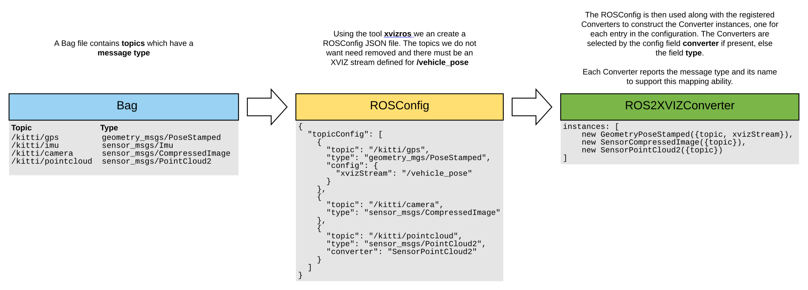

# Basic ROS Example

This example shows the quickest way to use the **@xviz/ros** module to start viewing ROS Bag data
with XVIZ in Streetscape.gl using just the messages currently supported. It should be enough to get
started and provide a base level of understanding for how pieces work together.

This will guide you through a few different examples for how to view different types of ROS data and
have it viewable in the streetscape.gl viewing application.

We will cover the following:

- Viewing a single topic useful for testing
- Viewing the vehicle position and orientation along with other data

## Setup

All the commands expect to ran from the **root** directory of the repo. When you are expected to
change directories the commands for that will be included.

#### Start the Streetscape viewer

[Start the streetscape.gl viewer](https://github.com/uber/streetscape.gl/tree/master/test/apps/viewer#running-the-viewer-app)
so it is ready.

#### Build the @xviz modules

Run `yarn bootstrap` in the repository root.

#### Convert KITTI data to a ROS Bag

We take advanage of the same KITTI data set used in other examples and use the tool
[kitti2bag](https://github.com/tomas789/kitti2bag) to convert the KITTI data into a ROS Bag for use
with this example.

You should rerun the KITTI download script to make sure you have all the files required.

```
$ ./scripts/download-kitti-data.sh
```

If you have support for docker, the following should work with the KITTI data used in our default
example.

```
$ docker run -v `pwd`/data/kitti:/data -it tomas789/kitti2bag -t 2011_09_26 -r 0005 raw_synced
```

This should place the bag file at `data/kitti/kitti_2011_09_26_drive_0005_synced.bag`

Note that the KITTI to ROS Bag conversion only supports pose, point cloud, and camera images.

#### Creating a ROSConfig

First we create a [ROSConfig](../../..//docs/api-reference/ros/ros-config.md) to describe what
topics we want and how they are mapped. This diagram shows the flow for the configuration.



##### Create your config.json

We can use the tool [xvizros](../../../docs/api-reference/ros/tools/xvizros-tool.md) to dump out the
topics and message types in a format we can then edit for specific needs.

This command will run the **xvizros** tool on the provided ROG bag file path and the output is
redirected to the target file **config.json**

```
$ ./modules/ros/bin/xvizros config data/kitti/kitti_2011_09_26_drive_0005_synced.bag > config.json
```

The output will look something like this:

```
{
  "topicConfig": [
    {
      "topic": "/tf_static",
      "type": "tf2_msgs/TFMessage"
    },
    {
      "topic": "/tf",
      "type": "tf2_msgs/TFMessage"
    },
    // more of the same
  ]
}
```

This file contains all the topics and their types. We will use this as the starting point and remove
any topics or add additional fields as necessary for the examples below.

## Example 1: Viewing a single topic

XVIZ currently requires a vehicle pose to drive the timing and position for visualization. This is
expected on the XVIZ stream `/vehicle_pose`. When we want to view just a single topic we can use an
available XVIZ Converter **XVIZFakePose** to respond to messages on our single topic and output the
required **fake** pose information.

To do this select the topic mapping entry from our **config.json** and remove all others. Next, add
an _additional_ mapping on the same topic that explicitly maps to the converter **XVIZFakePose** and
provide the **xvizStream** setting as "/vehicle_pose".

This is saved as config-1.json in this directory. Here is what it should look like.

```
{
  "topicConfig": [
    {
      "topic": "/kitti/velo/pointcloud",
      "type": "sensor_msgs/PointCloud2"
    },
    {
      "topic": "/kitti/velo/pointcloud",
      "converter": "XVIZFakePose",
      "config": {
        "xvizStream": "/vehicle_pose"
      }
    }
  ]
}
```

Now we will use that configuration to serve up the XVIZ data. We passing the configuration and the
directory holding the bag file file.

```
$ cd examples/converters/ros
$ yarn
$ node index.js -d ../../../data/kitti/ --rosConfig config-1.json
```

Finally, we can view the data, assuming the kitti bag we created earlier at
http://localhost:8080/kitti_2011_09_26_drive_0005_synced

What you should see is the vehicle and the point cloud as the vehicle moves through the scene.

## Example 2: Viewing the vehicle position and orientation along with other data

In this example, we will include additional topics that provide geospatial information and
orientation.

First, you must know what topics in your ROS data contains the appropriate information. In the KITTI
data set we use the topic with message type **sensor_msgs/NavSatFix** which contains the geospatial
information. The orientation we can get from the message type **sensor_msgs/Imu** in the topic
**/kitti/oxts/imu**.

There is one more change in order to ensure the map, vehicle, and point cloud data are all
coordinated correctly. In ROS the messages can have a **frame_id** which is used for transformating
data. We did not bother with this in example 1 because we didn't need to coordinate data across the
source.

We can inspect message from the topic to see the frame_id setting using the
[xvizros](../../../docs/api-reference/ros/tools/xvizros-tool.md).

This will dump the message data to stdout

```
$ ./modules/ros/bin/xvizros bagdump --dumpMessages -t /kitti/velo/pointcloud data/kitti/kitti_2011_09_26_drive_0005_synced.bag | grep frame_id
```

By running that command we can see that the frameId is **velo_link**, so we can add this to the
point cloud configuration. Use Control+C to terminate the command.

This is what the config for example 2 looks like.

```
{
  "topicConfig": [
    {
      "topic": "/kitti/oxts/gps/fix",
      "type": "sensor_msgs/NavSatFix",
      "config": {
        "xvizStream": "/vehicle_pose",
        "imuTopic": "/kitti/oxts/imu"
      }
    },
    {
      "topic": "/kitti/oxts/imu",
      "type": "sensor_msgs/Imu"
    },
    {
      "topic": "/kitti/velo/pointcloud",
      "type": "sensor_msgs/PointCloud2",
      "config": {
        "frameId": "velo_link"
      }
    }
  ]
}
```

We can now server up the data with this config.

```
$ cd examples/converters/ros
$ yarn
$ node index.js -d ../../../data/kitti/ --rosConfig config-2.json
```

You should see `xvizserver-log: Listening on port 3000`

We can view this as the same url http://localhost:8080/kitti_2011_09_26_drive_0005_synced

You should see the vehicle, the basemap, and the point cloud as the vehicle moves through the scene.

## Next Steps

This example explains the [ROSConfig](/docs/api-reference/ros/ros-config.md) and how it is used to
map topics and configure the converters. It also exposed you to the xvizros tool to get basic
information about your ROS Bag.

The next step is to see how to make your own Converters for ROS messages when necessary. Check out
the [Custom ROS Example](../ros-custom) for details.
